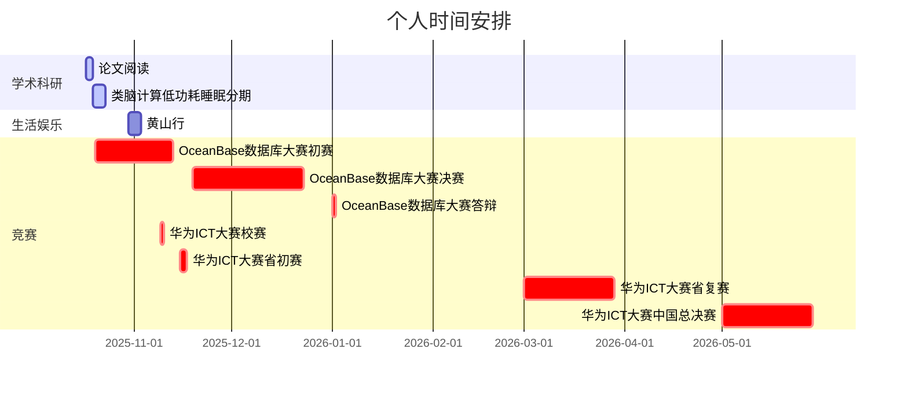
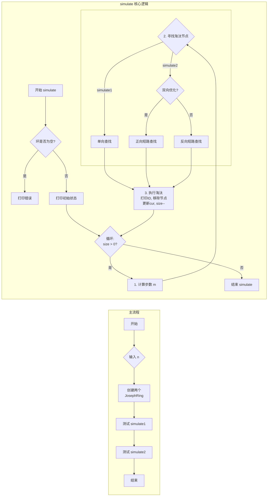
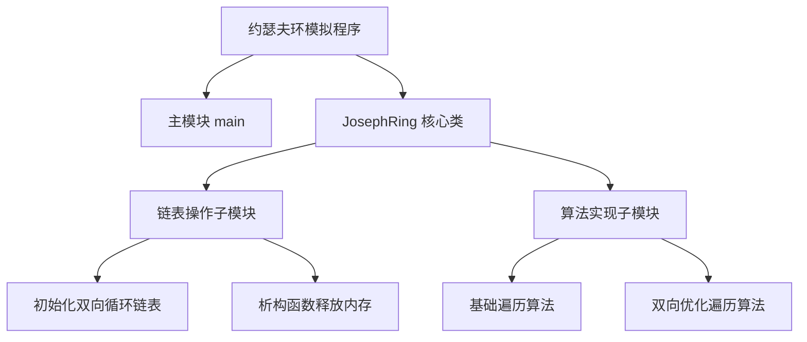

## 关于博客
其实自大一开始就想做一个像这样的网站，但是限于能力和见识，我不认为那时有能力把这样一个网站做好。
进入大二，在[wmsnp](https://github.com/wmsnp)的鼓励下，开始决定搭建这样一个网站，或许有些人是为了找工作而向github上塞各种东西，但我只是一种兴趣，我希望是因为兴趣而把一件事做好，而不是因为一件事做得很好而产生兴趣，我也没有这样的能力，如果那样，兴趣将毫无意义。

## 近期规划

### 2025下半年

---

