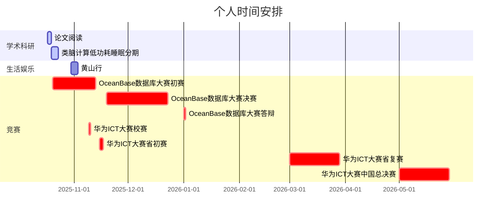
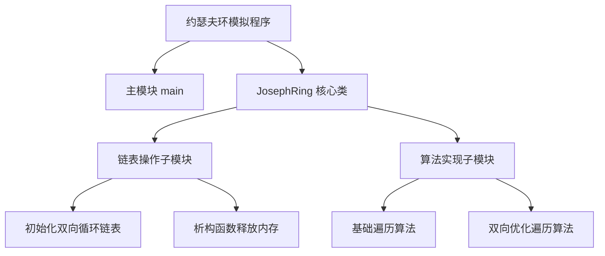

## 关于博客
其实自大一开始就想做一个像这样的网站，但是限于能力和见识，我不认为那时有能力把这样一个网站做好。
进入大二，在[wmsnp](https://github.com/wmsnp)的鼓励下，开始决定搭建这样一个网站，或许有些人是为了找工作而向github上塞各种东西，但我只是一种兴趣，我希望是因为兴趣而把一件事做好，而不是因为一件事做得很好而产生兴趣，我也没有这样的能力，如果那样，兴趣将毫无意义。

## 近期规划

### 2025下半年



```mermaid
graph TD;
    A[程序启动] --> B[主函数 main]
    B --> C[输入玩家总数 n]
    C --> D[创建 JosephRing 对象 ring1、ring2]
    D --> E[调用 ring1.simulate1() 执行算法1]
    E --> F[初始化双向循环链表（initRing）]
    F --> G[输出初始 Musk 列表（编号+Musk值）]
    G --> H[按当前节点 Musk 取模步长，正向遍历找淘汰节点]
    H --> I[输出淘汰编号，删除节点并维护链表]
    I --> J{剩余节点数>0?}
    J -- 是 --> H
    J -- 否 --> K[调用 ring2.simulate2() 执行算法2]
    K --> L[复用链表初始化逻辑，输出初始 Musk 列表]
    L --> M[按步长大小选择正向/反向遍历（优化效率）]
    M --> N[输出淘汰编号，删除节点并维护链表]
    N --> O{剩余节点数>0?}
    O -- 是 --> M
    O -- 否 --> P[调用析构函数 ~JosephRing() 释放内存]
    P --> Q[程序结束]

```




---
