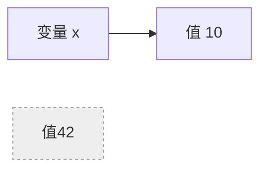
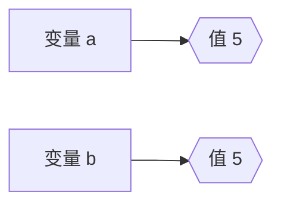
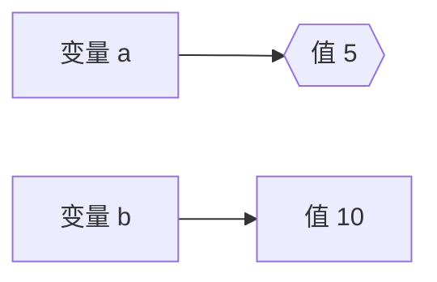
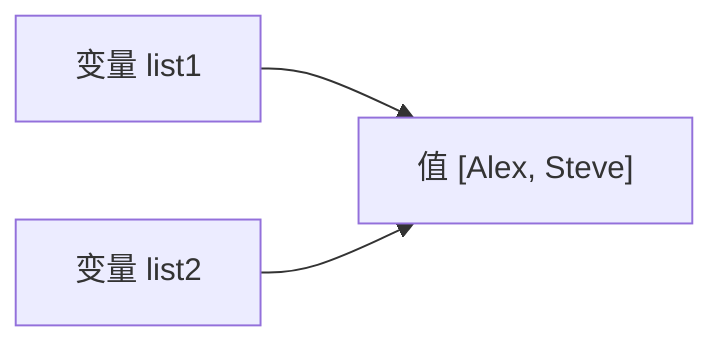
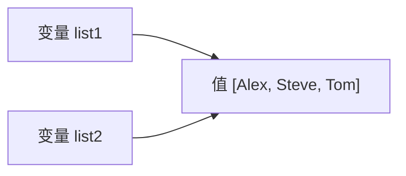

## 值、字面量

在上一节里，我们写了第一个 Java 程序 `Hello, World!`。你可能注意到，我们在代码里写下了`"Hello, World!"`这段文字，它就直接出现在屏幕上，我们把代码中写的 `"Hello, World!"` 这段文字、代码`1 + 2`中的 `1` 和 `2`，叫作**字面量**。当程序运行时，这些字面量会被转化为**值**并存储在内存中。值是程序的最小构件。它们是计算的结果，也是程序操作的对象。

>[!NOTE]
>**字面量**：写在源代码里的值的表示\
>**值**：程序运行时实际操作的对象

就像数学里的算式 2 + 3 = 5：\
2 和 3 是直接写下来的*字面量*；参与运算后得到的 5 是计算出来的*值*；而 2、3、5 在程序运行时都作为值存在。

我想你可能发现了，在程序中，有的值是自动产生的，例如在上一个实例中，我们输出了 `3`，这个数字是程序计算的值，而有的值是我们预先设计好的，例如上个示例中的`1` 和 `2`。我们需要用字面量来告诉Java程序。

字面量都有哪几种？它们又分别对应了怎样的值？我们来看下面的这张表格：

| 字面量类型 | 写法实例                    | 对应的值              |
| ----- | ----------------------- | ----------------- |
| 整数    | 42, -7, 0x12, 10L | 整数（byte、short、int、long）      |
| 浮点数   | 3.14, 2.5F, 10E5,            | 浮点数（double、float） |
| 布尔    | true, false             | 布尔值（boolean）：真、假           |
| 字符    | 'A', '?', '\n', '你'  | 单个字符（char）        |
| 字符串   | "Hello"                 | 一串字符（String）      |

你可能对很多术语还不太熟悉，没关系，我们还是用之前的 `println` 函数一个个来详细解释。

### 整数

为了节省内存开销，Java设计了多种整数的值类型。从小到大包括：byte，short，int，long。

其中，最常用的是：**int**

```Java {title="int的用法"}
System.out.println(1); // 这里的1对应了int类型
System.out.println(-1); // int可以是负数
System.out.println(0x1A); // 16进制数
```

然而，int只能存储从$-2^{31}$ 到$2^{31}-1$ 范围的整数，用来应付常规的Mod开发通常是足够的，但是Java也提供了更大范围的类型：**long**

```Java {title="long的用法"}
System.out.println(1000000000000000000L); // 在结尾加L的字面量将会被Java理解为long
```

### 浮点数

计算机中通常并不能存储精确的小数，而是将其近似存储为浮点数。在Java中，提供了两种浮点数：**double**和**float**，其中，`double` 的精度相对更高。

```Java {title="double和float的用法"}
System.out.println(1.0); // 有小数点，默认是double
System.out.println(2.0F); // 在结尾加F，将会被理解为float
System.out.println(0.1+0.2); // 令人遗憾，由于double的精度问题，结果为0.30000000000000004
```

鉴于浮点数的精度问题，你每次试图使用它时都需要慎重考虑。

> [!QUESTION]- 为什么直接调用println不会出错？
> 在 Java 中，`double` 用二进制近似表示十进制小数。字面量0.3在Java的程序中将会被翻译成一个很接近0.3的值，单独打印 0.3 时，Java 会自动找到一个最接近存储的值的十进制小数，看起来没有误差。
> 但是，当你做加法（比如 0.1 + 0.2）时，两个近似值的误差会叠加，以至于计算结果最接近的十进制小数不再是0.3，输出时就会显示微小的差异。

### 布尔

布尔值通常用于条件的判断。

```Java {title="boolean的用法"}
System.out.println(true); // 我是真
System.out.println(false); // 我是假
```
### 字符

在Java中，字符要用单引号`'`括起来，部分特殊的字符需要使用转义符号：

```Java {title="char的用法"}
System.out.println('A'); // 单个大写字母
System.out.println('你'); // 也可以是中文
System.out.println('?'); // 符号
System.out.println('\n'); // 转义字符，表示换行
System.out.println('\''); // 转义字符，表示单引号
```

### 字符串

Java的字符串用于表示一串字符（文本）。它可以包含一个或多个字符，甚至是空字符串。字符串用双引号`"`括起来，同样可以使用转义字符来表示特殊字符。

```Java {title="String的用法"}
System.out.println("Hello, World!"); // 普通字符串
System.out.println("玩家名字: Alex"); // 支持中文和其他Unicode字符
System.out.println(""); // 空字符串
System.out.println("这是第一行\n这是第二行"); // 使用换行转义字符
System.out.println("He said: \"Java is fun!\""); // 使用双引号转义
```

## 变量、作用域

在上一节里，我们介绍了值和字面量。值在程序中是最小的计算单位，但如果我们想重复使用某个值，或者想在程序中用它来表示“状态”，就需要用一个变量来存储，并且需要给它一个名字，这就是标识符，我们用标识符来找到我们想用的变量。

> [!IMPORTANT] 标识符
> **定义**：用户在程序中给类名、方法名、变量取的名字。
> 
> **硬性规则**：标识符可以包含：字母数字下划线以及$，但是不能以数字开头，也不能是关键字，且大小写敏感。
>
> **软性建议**：
>   - 类名：每个单词的首字母大写(大驼峰命名法)
>   - 方法名：首字母小写，后面每个单词的首字母大写(小驼峰命名法)
>   - 变量名：同方法名

---
{.awesome-hr}

好的，这是将您提供的所有文本都格式化为 Markdown 引用块（blockquote）之后的内容：

> [!DANGER]- 关键字
> ### 关键字
> 这里可以看到Java所有的关键字，不过不用急着学习，后面会逐步介绍。
>
> #### 什么是 Java 关键字？
>
> Java 关键字（Keywords）是 Java 语言中被赋予了特殊含义的单词。它们是预留的，不能用作变量名、方法名、类名或其他标识符。所有关键字都是小写的。
>
> #### Java 关键字列表 (按功能分类)
>
> 这张表格按照功能对关键字进行了分类，方便理解和记忆。
>
> | 分类 | 关键字 | 简要说明 |
> | :--- | :--- | :--- |
> | **访问控制** | `private` | 私有的，只能在当前类中访问。 |
> | | `protected` | 受保护的，在当前类、同一个包内以及所有子类中可以访问。 |
> | | `public` | 公共的，可以在任何地方访问。 |
> | **类、方法和变量修饰符** | `abstract` | 声明抽象类或抽象方法，没有具体实现。 |
> | | `class` | 声明一个类。 |
> | | `extends` | 表示一个类继承另一个类。 |
> | | `implements` | 表示一个类实现一个或多个接口。 |
> | | `interface` | 声明一个接口。 |
> | | `enum` | 声明一个枚举类型 (Java 5+)。 |
> | | `final` | 最终的。修饰类表示不能被继承；修饰方法表示不能被重写；修饰变量表示常量。 |
> | | `static` | 静态的，属于类本身而不是类的实例。 |
> | | `native` | 用于声明一个本地方法，该方法的实现由非 Java 语言（如 C/C++）完成。 |
> | | `new` | 创建一个新的对象实例。 |
> | | `strictfp` | 严格浮点，强制浮点计算遵循 IEEE 754 规范。 |
> | | `synchronized` | 同步的，用于控制多线程对共享资源的访问。 |
> | | `transient` | 临时的，修饰的成员变量在对象序列化时不会被保存。 |
> | | `volatile` | 易变的，确保多线程环境下共享变量的可见性。 |
> | **流程控制** | `if` | 条件语句的开始。 |
> | | `else` | `if` 条件不满足时执行。 |
> | | `switch` | 分支语句，用于多重条件判断。 |
> | | `case` | `switch` 语句中的一个分支。 |
> | | `default` | `switch` 语句中没有匹配 `case` 时的默认分支。 |
> | | `for` | 循环语句。 |
> | | `while` | 循环语句，先判断条件再执行。 |
> | | `do` | 循环语句，先执行一次再判断条件。 |
> | | `break` | 跳出当前循环或 `switch` 语句。 |
> | | `continue` | 跳过当前循环的本次迭代，进入下一次迭代。 |
> | | `return` | 从方法中返回，可以带返回值。 |
> | | `instanceof` | 判断一个对象是否是某个类或其子类的实例。 |
> | **异常处理** | `try` | 包含可能抛出异常的代码块。 |
> | | `catch` | 捕获并处理 `try` 代码块中抛出的异常。 |
> | | `finally` | 无论是否发生异常，总会执行的代码块。 |
> | | `throw` | 手动抛出一个异常对象。 |
> | | `throws` | 在方法签名中声明该方法可能抛出的异常类型。 |
> | | `assert` | 断言，用于程序调试，判断某个条件是否为真 (Java 1.4+)。 |
> | **包相关** | `package` | 声明类所在的包。 |
> | | `import` | 导入其他包中的类或接口。 |
> | **基本数据类型** | `boolean` | 布尔类型 (`true` 或 `false`)。 |
> | | `byte` | 字节类型 (8位)。 |
> | | `char` | 字符类型 (16位 Unicode)。 |
> | | `short` | 短整型 (16位)。 |
> | | `int` | 整型 (32位)。 |
> | | `long` | 长整型 (64位)。 |
> | | `float` | 单精度浮点型 (32位)。 |
> | | `double` | 双精度浮点型 (64位)。 |
> | **变量引用与返回类型** | `this` | 引用当前对象实例。 |
> | | `super` | 引用父类的成员（方法、构造器、变量）。 |
> | | `void` | 表示方法没有返回值。 |
> 
> ---
> 
> #### 特殊的保留字
> 
> 以下两个单词虽然是保留的关键字，但在当前的 Java 版本中并**未使用**。
> 
> | 关键字 | 说明 |
> | :--- | :--- |
> | `goto` | 保留字，未使用。在其他语言中用于无条件跳转。 |
> | `const` | 保留字，未使用。在其他语言中用于定义常量（Java 中使用 `final`）。 |
> 
> ---
> 
> #### 字面量 (Literals)
> 
> 虽然 `true`, `false` 和 `null` 看起来像关键字，但从技术上讲，它们是**字面量**（literal values）。不过，你同样不能将它们用作标识符。
> 
> | 字面量 | 说明 |
> | :--- | :--- |
> | `true` | 布尔类型的真值。 |
> | `false` | 布尔类型的假值。 |
> | `null` | 表示一个引用变量不指向任何对象的空值。 |
> 
> ---
> 
> #### 上下文关键字 (Contextual Keywords)
> 
> 从 Java 9 开始，引入了一些“上下文关键字”。它们只在特定的上下文中才被视为关键字，在其他地方可以作为合法的标识符使用。这样做是为了保持向后兼容。
> 
> | 关键字 | 使用上下文 | 说明 |
> | :--- | :--- | :--- |
> | `var` | 局部变量声明 (Java 10+) | 用于局部变量类型推断。 |
> | `record` | 类型声明 (Java 14+) | 用于声明记录类，一种不可变的数据载体。 |
> | `sealed` | 类/接口声明 (Java 15+) | 限制一个类或接口可以被哪些其他类或接口继承或实现。 |
> | `permits` | 类/接口声明 (Java 15+) | 与 `sealed` 一起使用，指定允许继承或实现的子类。 |
> | `non-sealed` | 类/接口声明 (Java 15+) | 声明一个 `sealed` 类的子类不是密封的，可以被任意继承。 |
> | `yield` | `switch` 表达式 (Java 12+) | 用于从 `switch` 表达式中返回一个值。 |
> | `module`, `requires`, `exports`, `opens`, `to`, `uses`, `provides`, `with`, `transitive` | 模块声明文件 (`module-info.java`) | Java 9 模块系统相关的关键字。 |

---
{.awesome-hr}

> [!NOTE]
> **变量**：程序中有类型、名字、存储空间的可变值。\
> **绑定**：变量名字和某个值之间建立的关系。

举个直观的例子：

```Java
// 假设已经存在了一个int类型的变量 health
health = 20; // 让变量health 绑定 值20
```

这里 `health` 是变量名，`20` 是值；赋值号 `=` 表示把这个值绑定到变量名上。
当我们在后续的代码中使用 `health` 时，Java 就会找到它对应的值 `20`。

### 声明、初始化

在 Java 中，使用变量前必须先声明它。声明告诉程序“我要使用一个名字作为变量名”，而初始化则把一个初始值绑定给变量。变量在声明时要指定类型，变量的类型一旦确定就不能被改变。

```Java 
int count; // 声明变量 count，还没有绑定值
count = 10; // 初始化绑定整数10

String player = "Alex"; // 也可以在声明的同时初始化，让player 绑定字符串Alex
```

> [!TIP]
> 在 Java 中，如果你尝试使用一个没有初始化的变量，会报错。初始化是第一次绑定值的机会。

### 赋值

变量可以被重新绑定到新的值。也就是说，变量名本身不变，但它指向的值可以改变（这样说并不准确，但是暂且可以这么理解）：

```Java
float health = 20; // 玩家当前生命值
System.out.println(health); // 20.0
health = 15; // health 现在绑定新值 15.0（int类型可以自动被转化为float）
System.out.println(health); // 15.0
```

最简单的绑定`int x = 42;`：


重新绑定`x = 10;`：

---

多个变量绑定到同一个值 `int a = 5; int b = a;`：


然后修改：`b = 10`:


---

引用类型的绑定： 
```Java
List<String> list1 = new ArrayList<>();
List<String> list2 = list1; // 假如是 new ArrayList<>()，会发生什么？
list1.add("Alex");
list1.add("Steve");
```


修改`list1`后：
```Java
list1.add("Tom");
System.out.println(list2); // 输出结果为[Alex, Steve, Tom]
```


### 作用域

变量的有效范围叫做作用域。在 Java 中，作用域决定了你在哪些地方可以使用某个变量，通常情况下，作用域由变量周围的`{ ... }`确定。

``` java {title="一个错误的程序"}
public class Main {
    public static void main(String[] args) {
        { // temp 在这个大括号中
            System.out.println(temp); // 这里还没有声明 temp，会报错
            int temp = 5;
            System.out.println(temp); // 5
        } // temp 在这个大括号中
        // 这里已经离开了 temp 的作用域，访问会报错
        System.out.println(temp); // 报错
    }
}
```

### 常量

如果你想创建一个不会改变的值，可以使用 final 关键字，通常我们会使用大写的字母命名以示区分。常量在初始化之后不能被重新绑定：
```Java
final int MAX_HEALTH = 20; // 最大生命值
System.out.println(MAX_HEALTH); // 20
MAX_HEALTH = 25; // 报错！final变量不能重新绑定
```

## 表达式与运算符

什么是表达式？直观来看，表达式就是能算出一个值的式子。例如，我们反复写到的`1 + 2`就是一个表达式，它算出的值是 `3`。既然是个值，就可以直接使用，也可以赋值给一个变量：

```Java
float health = 2 * 10; // health 是 20.0
System.out.println(health - 10); // 10.0
System.out.println(health); // 20.0，因为在上一行，我们只是求了一个表达式的值，并没有改变health绑定的值
health = health - 10; // 重新绑定 health
System.out.println(health); // 10.0
```

### 算术运算

```Java
int a = 1 - 2; // a 绑定了 -1
int b = 3 * 4; // b 绑定了 12
double c = 10 / 3; // c 绑定了 3.0，（先算整数除法结果为3，赋值给double变量时自动转为3.0）
double d = 10.0 / 3; // d 绑定了 3.3333...
int e = 10 % 3; // e 绑定了 1（取模）
int f = 3 + 10 * (10 / (1 + 1)); // 53，使用小括号改变运算优先级
```

> [!NOTE]
> 在除法运算中，若除数与被除数至少有一个是浮点数，那么按浮点数作除法；否则，结果为整数。
### 比较运算

```Java
int health = 20;
boolean b1 = health == 10; // false，等于
boolean b2 = health != 10; // true，不等于
boolean b3 = health > 10;  // true，大于
boolean b4 = health <= 20; // true，小于等于
boolean closeEnough = Math.abs(health - 20.0) < 0.0001; // true，浮点数使用近似比较。（Math.abs()求绝对值）
```
### 逻辑运算

```Java
boolean hasTool = false; // 没有使用工具
boolean canBreak = true; // 方块可被破坏

boolean canMine = hasTool && canBreak; // false，逻辑与(&&, 二者同时为true时结果为true)
boolean needWarning = !hasTool || !canBreak; // true，逻辑非(!, 取反) + 逻辑或(||, 二者有true即为true)
```

> [!NOTE] 短路运算符
> `&&` 和 `||` 是短路运算符：如果左边的值已经能决定结果，右边就不会再计算（尤其注意右边的表达式是否会带来副作用）。
### 一些运算符带有副作用

通常情况下，表达式的求值不会改变其中涉及的变量本身的值。然而，有一些带副作用的表达式（例如 `++`、`--`等）会在求值时顺带改变表达式中变量的值，这种副作用往往会带来意想不到的结果。**不要在赋值语句中使用它们**，除非你就是如此设计的。

```Java
int x = 5;
int y = x++;   // y 绑定了 5，x 再增加到 6
int z = ++x;   // x 先增加到 7，然后 z 绑定了 7
x += 3;        // x 绑定了 10，相当于 x = x + 3
```