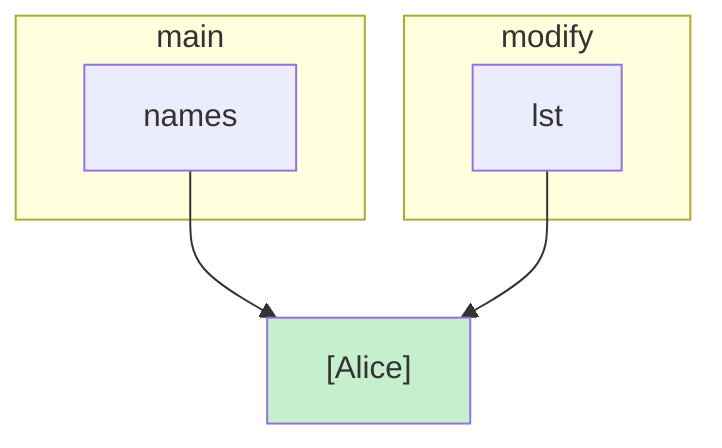
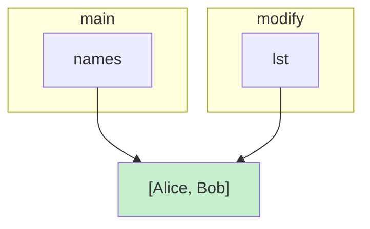
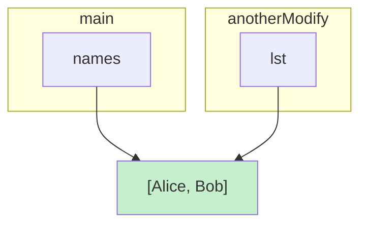
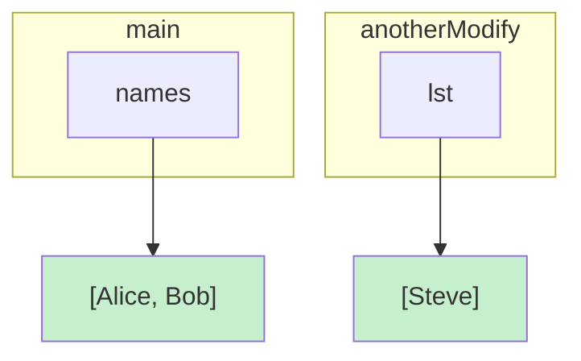

到目前为止，你学习的都是 Java 中最基础的内容：值、类型、变量、甚至简单的表达式和运算。它们看起来简单，也很直观——就像在玩积木，随手一搭就能看到结果。

但是，从这一节开始，情况就不一样了。在这一节中，你将进入 Java 中真正核心的概念之一——函数。函数不仅仅是“能执行一段代码”的工具，它们是程序的基本构建块，是把思路抽象成可复用逻辑的方式。这意味着，每一个函数的写法、每一个参数的设计、每一次返回值的使用，都直接关系到你能否用 Java 清晰、高效地表达你的想法。

除此之外，后面你还会学习到很多看起来抽象但非常重要的概念——无论是类、接口、泛型，还是注解、反射、事件。它们可能刚开始有些难理解，但在本教程中，我们将会深入地探究这些概念和用法，由此你就能用 Java 写出结构清晰、灵活、高效的 Mod 代码。

别担心，你已经掌握了基础类型和变量的概念，现在你只需要把这些基础组合起来，逐步理解函数的真正威力——你很快就会发现，函数不仅能让代码运行，更能让代码“会思考”。

## 函数的基本概念

在 Java 中，函数（方法）是一段可以重复执行的代码块，它接受输入（参数），并返回输出（返回值）。你可以把函数理解为一个“映射”：输入 → 输出。

一个函数由以下几部分组成：
```Java {.no-header}
返回类型 函数名(参数列表) {
    // 函数体：执行具体操作
    return 返回值;
}
```

+ 返回类型：函数执行后产生的结果类型。如果没有返回值，则使用 void；
+ 函数名：用来调用函数的标识；
+ 参数列表：函数接收的输入，每个参数都有类型和名字，多个参数用逗号分隔；
+ 函数体：包含函数要执行的语句；
+ return：将函数的结果返回给调用者（非 void 函数必须有返回值）。

例如：
```Java
// 定义一个函数 square，接收一个整数 x，返回 x 的平方
static int square(int x) {
    return x * x;
}

public static void main(String[] args) {
    int result = square(5); // 调用 square 函数
    System.out.println(result); // 输出 25
}
```

在这里，无论是你刚定义的`square`，还是系统内置的`println`，都是一个函数。不难看出，调用函数的方式也很简单：
```Java {.no-header}
函数名(传入的参数列表)
```

---

函数也可以有多个参数：
```Java
// 定义写在public class xxx { ... }里
static int add(int a, int b) {
    System.out.println("传入的a是：" + a);
    System.out.println("传入的b是：" + b);
    return a + b;
}

// 在main函数中调用：
int sum = add(3, add(2, 2)); // sum = 7
```

---

函数也可以没有返回值：
```Java
// 打印问候语，没有返回值
static void greet(String name) {
    System.out.println("Hello, " + name + "!");
}

// 在main函数中调用
greet("Alex"); // 输出: Hello, Alex!
```

```Java
void modify(List<String> lst) {
    lst.add("Bob"); // 修改对象内容
}

void anotherModify(List<String> lst) {
    lst = List.of("Steve"); // 绑定一个新的对象
}

public static void main(String[] args) {
    List<String> names = new ArrayList<>();
    names.add("Alice");
    modify(a);
}
```

函数调用时传递参数：绑定到同一个对象



使用`.add()`修改后：


调用`anotherModify`时：



`lst`绑定到新的对象上，不影响`names`：



## Lambda：将函数作为值

掌握了函数的基本用法，你可能会问，一个函数能作为参数传入另一个函数里吗？自然可以！让我们一步一步来。

### 将函数赋值给变量

由于历史包袱，像我们之前那样定义的普通函数，它的函数名并不能作为变量被使用：

```Java
static int square(int x) {
    return x * x;
}

public static void main(String[] args) {
    // 假设func是一个以函数为参数的函数
    func(square); // 报错！你不能这么写
}
```

相反，要将函数变成一个可以随处传递的值，有另一套相近的语法，我们叫它 **Lambda**：
```Java {.no-header}
参数名称 或 () -> 返回值 或 { ... }
```

例如：

```Java {.no-header}
(a) -> a * a

name -> {
    System.out.println("Hello, " + name + "!");
}
```

然而，单这么写，Java无法判断其类型，必须手动注明或从上下文推断。最简单的方法当然是将它与特定类型的变量绑定。

那么，对于不同参数和返回值的函数，它的类型是什么呢？常见的有下面几种：

| 类型             | 参数类型 | 返回值类型 | 调用方式             |
| -------------- | ---- | ----- | ---------------- |
| Runnable       | 0    | 无     | `.run()`         |
| Supplier\<R>   | 0    | R     | `.get()`         |
| Consumer\<T>   | T    | 无     | `.accept(传入的参数)` |
| Function<T, R> | T    | R     | `.apply(传入的参数)`  |

#### Runnable

`Runnable`是指没有参数，也没有返回值的函数，看起来就像是一个可以执行的任务：

```Java
Runnable sayHi = () -> System.out.println("Hi！");
sayHi.run(); // 输出: Hi！
```

#### Supplier

`Supplier<R>`是指没有参数，但有返回值（类型为`R`）的函数，看起来就像是它为你提供了一个值：

```Java
import java.util.function.Supplier

Supplier<Integer> randomNumber = () -> (int)(Math.random() * 100); // Java可以自动将 int 类型包装成 Integer
System.out.println(randomNumber.get()); // 产生一个 1 至 99 的随机数
```

> [!NOTE]
> 不幸的是，由于Java的历史包袱，你不能在`R`处写类似于`int`、`char`之类的基本类型，而是要写`Integer`、`Char`等（除了`int`，都是把首字母大写）。对于引用类型，可以直接使用。

#### Consumer

`Consumer<T>`是指有一个类型为`T`的参数，没有返回值的函数。

```Java
import java.util.function.Consumer;

Consumer<String> greet = name -> System.out.println("Hello, " + name + "!");

greet.accept("Alex"); // 输出: Hello, Alex!
```

#### Function

`Function<T, R>`是指，有一个类型为`T`的参数，返回值为`R`的函数。

```Java
import java.util.function.Function;

Function<Integer, Integer> square = x -> x * x;
System.out.println(square.apply(5)); // 输出 25
```

> [!NOTE] 更多类型
> + `Predicate<T>`：其实就是`Function<T, Boolean>`
> + `BiFunction<T, U, R>`：双参数的函数
> + 类似的`BiConsumer`等
### 将函数作为参数与返回值

假设我们需要设计这样一个函数：它能够重复执行另一个函数`n`次，不难想到，这个函数必须要以另一个函数为参数。很容易写出下面这个版本：

```Java {data-open=true}
import java.util.function.Consumer;

public class Main {
    // repeat 函数：接受一个动作和重复次数
    static void repeat(int n, Consumer<Integer> action) {
        for (int i = 0; i < n; i++) action.accept(i); // 调用传入的函数
    }

    public static void main(String[] args) {
        Consumer<Integer> printNumber = n -> System.out.println("执行次数：" + n);

        // 调用 repeat，重复执行 5 次
        repeat(5, printNumber);
        // 也可以直接用 Lambda 作为参数
        repeat(3, n -> System.out.println("直接执行次数：" + n));
    }
}
```

然而，假设我们想要执行同一个动作不同的次数，我们需要写：
```Java {.no-header}
repeat(3, printNumber);
repeat(5, printNumber);
repeat(10, printNumber);
```
未免有些麻烦。通过观察发现，这里有重复的逻辑，那就是`repeat(n, printNumber)`中，只有次数`n`在变化。如果能只写一次动作，而重复次数可以随时变化，会不会更方便？

换句话说，我想这样调用：`repeatPrint(5)`。\
这个`repeatPrint`函数干了什么呢？输入一个次数`n`，执行`repeat(n, printNumber)`，显然，这是一个`Consumer<Integer>`。也就是：
```Java {.no-header}
Consumer<Integer> repeatPrint = n -> repeat(n, printNumber);
```
让我们更进一步，假设我现在需要执行的动作也变得多了起来：
```Java {.no-header}
Consumer<Integer> repeatPrint = n -> repeat(n, printNumber);
Consumer<Integer> repeatPrint2 = n -> repeat(n, printNumber2);
...
```
能不能有一个函数，让我能够方便地得到`repeatXXX`？就像这样：
```Java {.no-header}
Consumer<Integer> repeatPrint = makeRepeat(printNumber);
```
我们还是从`makeRepeat`入手，它是一个以`Consumer<Integer>`为参数，返回`Consumer<Integer>`的函数，自然可以写：

```Java {.no-header}
Consumer<Integer> makeRepeat(Consumer<Integer> action) {
    return n -> repeat(n, action);
}
```

让我们来看这个完整的例子：

```Java {data-open=true}
import java.util.function.Consumer;

public class Main {
    // 原始 repeat 函数：重复执行动作 n 次
    static void repeat(int n, Consumer<Integer> action) {
        for (int i = 0; i < n; i++) action.accept(i);
    }

    // makeRepeat：返回一个函数，接收重复次数 n，执行 repeat
    static Consumer<Integer> makeRepeat(Consumer<Integer> action) {
        return n -> repeat(n, action);
    }

    public static void main(String[] args) {
        // 定义不同的动作
        Consumer<Integer> printNumber = n -> System.out.println("执行次数：" + n);
        Consumer<Integer> printSquare = n -> System.out.println("平方：" + n * n);

        // 使用 makeRepeat 生成 repeatXXX
        Consumer<Integer> repeatPrint = makeRepeat(printNumber);
        Consumer<Integer> repeatSquare = makeRepeat(printSquare);

        // 调用闭包函数，传入次数
        repeatPrint.accept(3);
        repeatSquare.accept(5);
    }
}
```

发生了什么？我们发现，`makeRepeat` 接收一个动作 `action`，返回一个新函数：`n -> repeat(n, action)`\
这个“新函数”以后被调用时，仍然能用到当初传进来的 `action`。

在 `makeRepeat` 里，返回的函数捕获了 `makeRepeat` 外部的 `action`；即使 `makeRepeat` 早就执行完了，传入的`action`也已经离开了它的作用域，返回的函数仍然记得 `action`。

这就是**闭包**——函数带着它诞生时的环境。

`repeatPrint`、`repeatSquare`两个返回的函数“长得像”，但各自携带的 `action` 不同，因此行为不同——这正是闭包的力量。

### 闭包

庆幸的是，Java的历史包袱还没有沉重到连闭包都不能支持。

```Java {data-open=true}
import java.util.function.Consumer;

public class Main {
    public static void main(String[] args) {
        // 外部变量：动作
        Consumer<Integer> printNumber = n -> System.out.println("执行次数：" + n);

        // 闭包：返回函数，只需要提供次数 n，动作已经被捕获
        Consumer<Integer> repeatPrint = n -> {
            for (int i = 0; i < n; i++) printNumber.accept(i); // 自动捕获了 printNumber
        };

        // 调用闭包
        repeatPrint.accept(3);
    }
}
```

在上面的例子中，`repeatPrint` 就是一个闭包。它捕获了外部变量 `printNumber`，所以即使在函数内部没有显式传入动作，也能使用它。

> [!NOTE] 闭包
> 闭包 = 函数 + 创建函数时捕获的环境
> 
> 换句话说，闭包会记住它被创建时可用的变量，即便函数已经返回或作用域结束。

---

然而，被闭包捕获的变量不能再进行赋值（如果你实在想捕获可变变量，不妨用容器包装它，但是并不推荐）：

```Java
int base = 10; // 局部变量
Consumer<Integer> c = n -> System.out.println(base + n);
base = 20; // 报错！
```

---

```Java {data-open=true}
import java.util.function.Consumer;

public class Main {
    // 生成打印动作的闭包
    static Consumer<Integer> LoggerBuilder(String prefix) {
        // 局部变量 prefix 被闭包捕获，闭包可以访问它
        return n -> System.out.println(prefix + "值: " + n);
    }

    public static void main(String[] args) {
        // 生成闭包
        Consumer<Integer> attackCallback = LoggerBuilder("[攻击] ");
        Consumer<Integer> healCallback = LoggerBuilder("[治疗] ");

        // 模拟事件被触发（在真实开发中，当某些条件满足时，将会自动调用triggerAction）
        triggerAction(attackCallback, 10);
        triggerAction(healCallback, 5);
        triggerAction(attackCallback, 20);
    }

    // 模拟触发函数
    static void triggerAction(Consumer<Integer> callback, int value) {
        System.out.println("=== 玩家动作触发 ===");
        callback.accept(value);
    }
}
```

这是闭包的一个经典用法：`attackCallback`和`healCallback`都是闭包，我们往往并不是立刻执行闭包中的逻辑，而是希望当某些事件发生后，自动执行它们。

## 方法引用

刚才，我们学习了 Lambda 表达式，它让函数可以作为值传递，并可以轻松创建闭包。

有时候，一个 Lambda 表达式非常简单，只是调用一个已有的方法。为了让代码更简洁、可读，Java 提供了方法引用，它是 Lambda 的简写。

> [!TIPS]- 注
> 由于我们还没有深入学习Java的类和对象，在本章，我们只使用系统提供的对象或静态方法，不涉及自定义类和对象。

方法引用点写法很简单：
```Java {.no-header}
类或对象::方法名
```

### 引用对象的方法

```Java {data-open=true}
public class Main {
    public static void main(String[] args) {
        String[] items = {"WOOD", "STONE", "IRON"};

        // 使用 Lambda 打印每个元素
        for (String item : items) {
            Runnable r = () -> System.out.println(item); // 自动捕获外部变量
            r.run();
        }

        // 使用方法引用（System.out 是 Java 内置对象，println 是它的一个方法）
        for (String item : items) {
            Consumer<String> r = System.out::println;
            r.accept(item);
        }
    }
}
```

### 引用类的方法

```Java {data-open=true}
import java.util.function.Consumer;

public class Main {
    // 静态方法
    static void printItem(String s) {
        System.out.println(s);
    }

    public static void main(String[] args) {
        String[] items = {"WOOD", "STONE", "IRON"};

        // Lambda
        Consumer<String> p1 = s -> printItem(s);
        for (String item : items) p1.accept(item);

        // 方法引用
        Consumer<String> p2 = Main::printItem;
        for (String item : items) p2.accept(item);
    }
}
```
## 流

> [!NOTE] 什么是对象
> 在 Java 中，我们之前接触的值和函数都是比较“独立”的：一个变量存储一个值，一个函数执行一个操作。但实际上，在Java中，几乎所有值都可以被视为某种对象——对象可以理解为带有行为的值。
> 你对“对象带有行为”应当并不陌生：
> ```Java {.no-header}
> System.out.println( ... )
> ```
> 这里的`out`就是一个对象，`println`就是它带有的一个行为，你可以叫它行为，方法，或是函数，都是同样的意思。
> 不论怎样，我们可以用`.`来调用一个对象拥有的方法。倘若这个方法的返回值又是一个对象，我们便可以：
> ```Java {.no-header}
> 对象.方法一( ... ).方法二( ... ).方法三( ... )......
> ```
> 这就是**链式调用**

在前面我们学习了 Lambda 表达式、闭包和方法引用，它们让函数可以作为值被传递和组合。\
接下来，Stream API 是 Java 提供的一种函数式处理集合的工具，它允许我们用管道式操作处理列表、数组等数据结构。

> [!NOTE]
`Stream<T>` 不是存储数据的容器，它只是“数据操作的管道”。它本身不改变原集合，只在终端操作时才执行计算。

> [!TIPS]- 这么多函数到底谁记得住啊😡
> 下面将会出现很多方法，看懂，并且知道 `Stream` 能实现什么功能即可，需要使用时可以再翻阅或询问AI
### 创建操作

创建 `Stream` 是操作数据的第一步。对于非数组的集合类型，你可以用`.stream()`很方便地创建流：

```Java {.no-header}
List<String> items = List.of("WOOD", "STONE", "IRON");

// 从 List 创建顺序流
Stream<String> stream1 = items.stream();
// 从 List 创建并行流
Stream<String> stream2 = items.parallelStream();
```

对于数组，你需要使用`Arrays.stream( ... )`：
```Java {.no-header}
String[] ss = {"APPLE", "GOLD", "DIAMOND"}
Stream<String> stream3 = Arrays.stream(ss);
```

--- 

`Stream`还提供了一些方法直接创建流，例如：

+ 从元素直接创建流
```Java {.no-header}
Stream<String> stream3 = Stream.of("DIAMOND", "GOLD", "APPLE");
```
+ 从无参函数`Supplier<T>`创建流
```Java {.no-header}
// 创建随机数流
Stream<Double> randomNumbers = Stream.generate(Math::random);
```
> [!TIPS] 
> 往往用来生成固定值、随机数
+ 从初始值和递推函数创建流
```Java {.no-header}
// 创建流：0, 2, 4, 6...
Stream<Integer> evenNumbers = Stream.iterate(0, n -> n + 2);
```

### 终端操作

终端操作会启动整个流的计算，并返回最终结果或产生副作用。
#### 遍历
+ `.forEach(Consumer)`：对每个元素执行动作
```Java
// 打印每个元素
items.stream().forEach(System.out::println);
```
#### 统计收集
+ `.count()`：统计元素数量
+ `.collect(Collector)`：将流转换到其他形式，例如 `List`、`Set`、`Map` 等
+ `.toList()`：将流转换为 `List`
```Java
import java.util.stream.Collectors;

List<String> items = List.of("WOOD", "STONE", "IRON");
// 无事发生
List<String> alsoItems = items.stream()​.collect(Collectors.toList());
// 这不就是items.size()吗😠
long c = items.stream().count();
```

#### 匹配查找

+ `.anyMatch` / `.allMatch` / `.noneMatch` `(Predicate)`：当任意/所有/没有元素满足条件时返回`True`
+ `.findFirst()`：获取流中第一个元素

```Java
List<String> items = List.of("WOOD", "STONE", "IRON").stream();

boolean hasIron = items.stream().anyMatch(s -> s.equals("IRON")); // true

Optional<String> first = items.stream().findFirst(); // Steam可能没有元素
System.out.println(first.orElse("流中没有元素！")); // WOOD
```

#### 聚合

+ `.reduce(初始值, 归约函数)`：用一个归约函数把整个列表“聚合”成一个值，而不需要显式循环。归约函数是指用于将当前累积值和流中下一个元素合并，得到新的累积值的函数。
+ `.reduce(归约函数)`：返回`Optional<T>`

```Java
Stream<Integer> numbers = Stream.of(1, 2, 3, 4, 5);

int sum = numbers.reduce(0, (a, b) -> a + b); // 15
```
### 中间操作

中间操作会返回一个新的 `Stream`（不会执行计算），可以链式组合，常用操作如下：
#### 截取

+ `.limit(n)`：取前`n`个元素
+ `.skip(n)`：跳过前`n`个元素

```Java
// 包含5个随机数的流
Stream<Double> randomStream5 = Stream.generate(Math::random).limit(5);
```

#### 排序

+ `sorted()`：从小到大排序
+ `sorted(Comparator)`：按照给定的比较函数排序

```Java
// 从小到大排序
Stream<Integer> s1 = Stream.of(3, 1, 2).sorted(); // 1, 2, 3
// 从大到小排序
Stream<Integer> s2 = Stream.of(3, 1, 2).sorted((p, q) -> p - q); // 3, 2, 1
```

#### 过滤
+ `filter(Predicate)`：筛选符合条件的元素
+ `distinct()`：去重

```Java

List<String> items = List.of("WOOD", "STONE", "IRON", "STONE");
// 选出字符串长度大于4的元素并去重，然后转回List
List<String> newItems = items.stream().filter(s -> s.length() > 4).distinct().toList(); // "STONE"
```

#### 映射

+ `.map(Function)`：将给定函数应用于每个元素

```Java
List<String> items = List.of("WOOD", "STONE", "IRON");
// 转化为小写并输出
items.stream().map(String::toLowerCase).forEach(System.out::println); // wood stone iron
```

### 实例

在 Minecraft Mod 开发中，一个常见的工作是为物品编写合成表。为了让 Minecraft 知道你的设定，你需要提供一种特定类型的值：`Ingredient`。然而，为了便于书写，我们往往会用物品的ID，或者你定义的物品的类名来描述合成表。

让我们来写一个工具函数，把某些特定的字符串解析成`Ingredient`！

+ 标识符可能是单个物品，如 `minecraft:iron_ingot`
+ 也可能是标签，如 `#minecraft:planks`
+ 可能有数量前缀，如 `3minecraft:iron_ingot`，表示 3 个物品
+ 可能是多选项组合，用 | 分隔，如 `minecraft:iron_ingot | modname:gold_ingot`

#### 处理多项组合

假设我们传入的标识符是：
```Java {.no-header}
String itemIdentifier = "minecraft:iron_ingot | modname:gold_ingot";
```
目标：把它拆分成单个可处理的选项：
```Java {.no-header}
"minecraft:iron_ingot"
"modname:gold_ingot"
```

> [!NOTE] 分割字符串
> `.split(...)`方法可以以给定的内容为分割，将字符串拆分成一个列表，如：
> ```Java {.no-header}
> ["minecraft:iron_ingot", "modname:gold_ingot"]
> ```

为了方便后续处理，我们希望将它变成一个流：
```Java {.no-header}
Arrays.stream(itemIdentifier.split("\\|")).map(String::trim);
```

> [!NOTE] 过滤空白字符
> `.trim()`可以过滤首尾的空白字符

#### 解析单个选项

有两种情况：
+ 如果以 `#` 开头 → 这是一个标签，设计一个 `parseTag` 函数来生成 `TagKey`
+ 否则 → 这是普通物品，调用我们之前在学习正则表达式时设计的 `parseItem` 来生成 `Item`

我们可以用映射来实现：对流中的每一个元素，应用以下操作：
```Java {.no-header}
o -> o.startsWith("#") ? Ingredient.of(parseTag(o.substring(1)) : Ingredient.of(parseItem(o))
```

> [!INFO]-
> 在这里隐去了`Ingredient.of()`和`parseTag()`的实现细节，因为它们涉及到了 NeoForge 是如何管理 Minecraft 资源的。

这样，我们得到了`Stream<Ingredient>`
#### 合并选项

虽然我们得到了一个`Ingredient`流，但是我们的返回值要求是一个`Ingredient`。

在Minecraft中，`Ingredient.fromValues(Stream<Ingredient.Value>)`为我们提供了一个合并的方法，因此，我们现在的目标是：将`Stream<Ingredient>`变成`Stream<Ingredient.Value>)`。

而获取`Value`很简单：`.getValues()`就得到一个`Value`数组

那么，是不是就很简单了：

```Java {.no-header}
Ingredient.fromValues(先前的结果.map(Ingredient::getValues))
```

当然不是。

`Ingredient::getValues`返回的结果是`Value[]`，因此，经过映射后的流是`Stream<Value[]>`，这不是我们想要的。让我们将`Value[]`变成一个新流，并将其扁平化：

```Java {.no-header}
Ingredient.fromValues(先前的结果.map(Ingredient::getValues).flatMap(Stream::of))
```

> [!INFO] 扁平化
> `flatMap` 用于将嵌套流“展平”为单一流

完整的代码如下：

```Java {data-open=true}
public static Ingredient parseIngredient(String itemIdentifier) {
    return Ingredient.fromValues(
        Arrays.stream(itemIdentifier.split("\\|")).map(String::trim) // 拆分多选项，去掉多余空格
            .map(o -> o.startsWith("#") ? Ingredient.of(parseTag(o.substring(1))) : Ingredient.of(parseItem(o)))
            .map(Ingredient::getValues) // 得到 Stream<Ingredient.Value[]>
            .flatMap(Stream::of) // 扁平化成 Stream<Ingredient.Value>
    );
}

private static ItemStack parseItemLike(String itemIdentifier) { ... }
private static TagKey<Item> parseTag(String tagIdentifier) { ... }
```