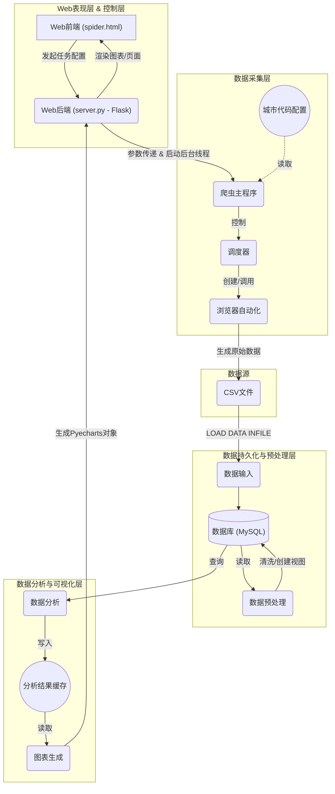

## 1. 项目简介

本项目旨在构建一个全面的、自动化的招聘数据分析与可视化平台。平台通过自主开发的高性能网络爬虫，从主流招聘网站（当前为前程无忧）实时采集职位数据。数据经过系统化的ETL（提取、转换、加载）流程和深度统计分析，提取出有关薪资分布、技能需求、地域差异等有价值的市场洞察。最终，所有分析结果通过一个现代化的Web界面，以交互式图表的形式进行可视化呈现，为用户提供直观、易懂的数据支持。

## 2. 系统架构与技术选型

为实现项目目标，我们采用了基于Python的模块化分层架构。该架构确保了各组件职责明确、低耦合、易于维护和扩展，将复杂的数据流程清晰地解构为独立的逻辑层次。

### 2.1 系统总体架构

系统架构遵循一条从用户输入到最终可视化输出的清晰数据流，涵盖了Web控制、数据采集、数据持久化、分析计算和可视化呈现五大核心环节。

**架构流程图:**


### 2.2 技术栈构成

*   **浏览器自动化与数据采集:** **Selenium** - 用于驱动真实的Chrome浏览器执行JavaScript并获取由API动态加载的数据，能有效应对现代网站的反爬虫机制。
*   **并发模型:** **Multiprocessing** - 采用Python的多进程模型实现真正的并行爬取，充分利用服务器的多核CPU性能，大幅提升数据采集效率。
*   **后端Web框架:** **Flask** - 一个轻量级的Web框架，用于构建Web服务，提供功能丰富的爬虫控制界面、任务状态反馈和最终的数据可视化展示。
*   **数据库管理系统:** **MySQL** & **PyMySQL** - 作为一个稳定、高效的关系型数据库，用于数据的持久化存储、管理和查询。
*   **数据分析库:** **Pandas** & **NumPy** - Python数据科学生态的核心，用于执行高性能的数据处理、清洗、转换和复杂的统计分析。
*   **数据可视化库:** **Pyecharts** - 一个强大的数据可视化库，能够生成基于Apache ECharts的、美观且高度交互的前端图表。
*   **前端交互增强:** **jQuery** & **Select2** - 用于为前端页面提供美观、易用的可搜索多选框等高级UI组件，显著提升用户体验。
*   **配置文件解析:** **ConfigParser** - Python标准库之一，用于管理爬虫参数和存储分析结果，实现了配置与代码的分离。

## 3. 核心模块实现细节

本节将按照数据流动的顺序，详细解析各核心模块的功能、实现策略及关键代码。

### 3.1 数据采集层 (爬虫模块)

这是整个数据流程的源头，已升级为一套高性能、高可控性的采集系统。

*   **`spider_main.py` (爬虫主程序):**
    *   **功能:** 作为爬虫的入口点和总调度器，它接收来自Flask前端的复杂参数（目标城市、职位关键词、数量上限、并发开关、定时设置），并根据这些参数编排整个爬取过程。
    *   **实现策略:**
        1.  **并发/串行模式切换:** 根据用户在前端“开启并发”开关的状态，动态选择执行路径。开启时，为每个任务（城市-职位组合）创建一个独立的`SpiderProcess`进程以实现并行抓取；关闭时，则在主进程中串行执行每个任务，适用于低性能环境或需要慢速抓取的场景。
        2.  **数量上限控制:** 在`Job51Spider`爬虫类的核心循环中，内置了计数器和上限判断逻辑，确保每个任务抓取的数据量严格遵守用户的设定，实现了按需采集。
        3.  **定时调度:** 内置一个主循环，可以根据用户设定的每日起止时间和任务间隔，自动、周期性地触发爬取任务。该功能通过在Flask后台线程中运行，实现了长期、无人值守的自动化数据更新。
        4.  **环境解耦:** 实现了**环境变量**方案来管理`chromedriver`。代码会自动在系统`Path`中寻找驱动程序，从而避免了因浏览器自动更新或项目迁移导致的版本不匹配和路径错误问题，极大地增强了项目的健壮性和可移植性。

*   **`spidier/conf.ini` (爬虫配置文件):**
    *   **功能:** 存储了城市中文名到其对应网站内部编码的映射表。
    *   **实现策略:** 这是一个标准的INI格式配置文件，使得爬虫可以根据人类可读的城市名（如“北京”）动态查找并使用网站API所需的编码（如“010000”），避免了在代码中硬编码这些值，增强了爬虫的灵活性和可维护性。
    **关键代码示例 (`spidier/conf.ini`):**
    ```ini
    [citycode]
    北京 = 010000
    上海 = 020000
    广州 = 030200
    ...
    ```

### 3.2 数据输入模块 (`input_data.py`)

**功能:** 负责将爬虫生成的、统一格式的 `qcwy.csv` 数据高效地导入到MySQL数据库中。

**实现策略:** 为最大化数据导入性能，本模块直接执行MySQL的`LOAD DATA INFILE`语句。这是MySQL原生支持的、性能最优的批量数据加载命令，其速度远超逐条`INSERT`。该模块负责在导入前清空旧数据，确保每次分析的都是最新的全量数据。

**关键代码:**
```python
# analysis/input_data.py
sql_load_data = f"""
LOAD DATA INFILE '{csv_path}'
INTO TABLE `{table_name}`
CHARACTER SET 'utf8mb4'
FIELDS TERMINATED BY ',' OPTIONALLY ENCLOSED BY '"'
LINES TERMINATED BY '\\r\\n'
IGNORE 1 LINES
{columns};
"""
analysis_main.Analyze.cursor.execute(sql_load_data)
analysis_main.Analyze.db.commit()
```

### 3.3 数据预处理模块 (`process_data.py`)

**功能:** 对数据库中的原始数据进行清洗、格式化，并创建一系列用于简化分析的数据库视图（VIEW）。

**实现策略:**
1.  **数据清洗:** 利用Python的`re`模块（正则表达式）和SQL `UPDATE`语句，对`salary`（如“1.5-2万/月”）、`experience`（如“3-5年经验”）等非结构化文本字段进行深度解析，提取出可用于计算的数值，并存入专门的`MIN_PAY`, `MAX_PAY`, `AVE_PAY`等字段。
2.  **视图创建:** 通过执行一系列`CREATE VIEW`语句，根据职位关键词、行业分类等条件，创建逻辑数据子集。例如，创建一个`'新兴职业'`视图，它包含了所有标题含“人工智能”、“区块链”等关键词的职位。这使得后续分析师无需编写冗长复杂的`WHERE`子句，可以直接从业经分类的视图中查询，极大地提高了代码的可读性和查询效率。

**关键代码:**
```python
# analysis/process_data.py
@ways
def oldnew_view():
    sql = 'create view `新兴职业` as select ... from qcwy where (qcwy.title like "%学习%" or qcwy.title like "%人工智能%" ...)'
    cursor.execute(sql)
```

### 3.4 数据分析模块 (`analysis_data.py`)

**功能:** 执行所有核心的统计分析任务，并将计算出的聚合结果输出到配置文件中，作为下一阶段的输入。

**实现策略:** 该模块是Pandas库应用的集中体现。它包含21个独立的分析函数，每个函数都专注于一个特定的分析维度。
1.  **数据获取:** 函数首先通过SQL从数据库（通常是预处理阶段创建的视图）中查询所需数据。
2.  **数据转换:** 查询结果被迅速转换为Pandas `DataFrame`对象，这是进行高效数据操作的基础。
3.  **分析计算:** 利用`DataFrame`强大的API进行分组(`groupby`)、聚合(`sum`, `mean`)、排序(`sort_values`)等一系列操作，提炼出最终的统计结果（如TOP10列表、各类别平均值等）。
4.  **结果输出:** 计算出的结果（通常是列表或字典）被序列化为字符串，并通过`ConfigParser`写入到`conf/conf.ini`文件中。这个文件充当了分析层与可视化层之间的轻量级数据交换媒介，实现了两者的解耦。

**关键代码 (分析大数据职位城市需求TOP10):**
```python
# analysis/analysis_data.py
@ways
def f5():
    cursor.execute("select place,number from 大数据职位")
    df = pd.DataFrame(list(cursor.fetchall()), columns=['place', 'num'])
    df['num'] = df['num'].astype('int')
    
    a = df.groupby('place').sum().sort_values(by='num', ascending=False)
    
    top_cities = list(a.index[:10])
    top_numbers = list(np.array(a.values[:10]).ravel())
    
    conf.set('chart', 'chart.5.1', str(top_cities))
    conf.set('chart', 'chart.5.2', str(top_numbers))
```

### 3.5 图表生成与Web服务模块 (`create_chart.py` & `server.py`)

**功能:** 将分析结果可视化，并通过Web服务以用户友好的方式呈现。

**实现策略:**
1.  **`create_chart.py`**:
    *   **职责**: 扮演“图表设计师”的角色。
    *   **流程**: `main`函数首先读取`conf/conf.ini`文件，将分析结果加载到内存。随后，它调用21个独立的绘图函数，每个函数负责将一组特定的数据实例化为一个Pyecharts图表类（如`Bar`, `Pie`, `HeatMap`），并配置其样式和交互。
    *   **路径与错误处理**: 已对文件读取进行绝对路径处理，并增加了异常捕获机制，确保在配置文件不存在或单个图表生成失败时，应用不会崩溃。

2.  **`server.py` (Flask应用)**:
    *   **职责**: 作为整个应用的“神经中枢”，处理用户请求并调度后端逻辑。
    *   **启动性能优化**: 通过对数据库连接模块进行**延迟加载**重构，避免了在服务启动时执行耗时的I/O操作，实现了服务的快速启动和页面的秒级响应。
    *   **预加载机制**: 服务器在启动时会**预先调用`create_chart.main()`**，将所有21个图表对象加载到内存中。
    *   **API式渲染**: 定义了一个动态API路由 (`/chart/<id>`)。当Web前端需要显示图表时，会通过JavaScript向此API发起请求。后端只需从内存中根据ID取出对应的图表对象，并调用其`render_embed()`方法返回该图表的HTML/JS渲染代码片段。这种前后端分离的“懒加载”渲染方式，极大地提升了包含大量图表的报告页面的加载性能。
    *   **用户体验增强**:
        *   对所有子页面增加了统一的导航栏，优化了页面间的跳转。
        *   为耗时的爬虫任务提供了**友好的后台任务反馈页面**，并能正确处理爬取过程中或爬取前的结果查看请求，避免向用户暴露错误。

**关键代码 (`server.py`):**
```python
# server.py
from flask import Flask, render_template

app = Flask(__name__)
charts = create_chart.main() # 启动时预加载所有图表

@app.route('/chart/<id>')
def showresult1(id):
    # 根据前端请求，从内存中取出图表对象
    t = charts[int(id)] 
    # 返回该图表自身的渲染代码
    return t.render_embed()
```

## 4. 总结

本项目通过模块化的设计和对Python生态中成熟库的深度整合，成功实现了一个从数据采集、处理、分析到Web呈现的完整数据分析流程。系统架构清晰，通过采用多进程、后台任务、延迟加载和API式渲染等技术，保证了高性能和良好的用户体验。同时，通过配置文件和环境变量等方式，实现了代码与配置的有效分离，具备良好的可维护性和可扩展性。

**未来的优化方向包括：**
*   **改进数据交换机制:** 考虑使用更高效、更安全的数据交换方式（如Redis、API）替代配置文件。
*   **爬虫框架升级:** 对于大规模采集任务，可将爬虫重构为基于Scrapy框架的分布式爬虫。
*   **增强系统安全性:** 移除硬编码的敏感信息，并对所有外部输入进行严格的校验与参数化处理。
