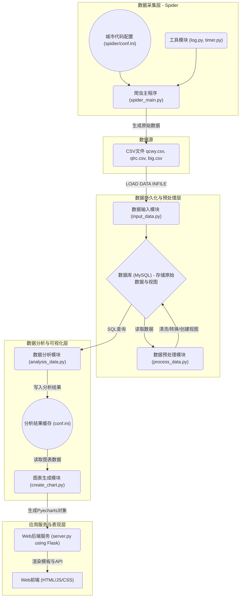

## 1. 项目简介

本项目旨在构建一个全面的招聘数据分析与可视化平台。平台通过**自主开发的网络爬虫**从主流招聘网站采集职位数据，经过系统化的数据处理与分析流程，提取有价值的市场洞察，并最终通过Web界面以交互式图表的形式进行可视化呈现。系统完整覆盖了从数据采集到最终应用的全生命周期。

## 2. 系统架构与技术选型

为实现项目目标，我们采用了基于Python的模块化分层架构，确保各组件职责明确、低耦合、易于维护。

### 2.1 系统总体架构

系统架构设计将数据流清晰地划分为**数据采集层**、数据持久化与预处理层、数据分析与可视化层以及应用服务与表现层。

**架构流程图:**


### 2.2 技术栈构成

*   **数据采集:** **Requests** (隐含在`log.py`中，通常与`BeautifulSoup`或`Scrapy`等库配合使用) - 用于发送HTTP请求，获取网页数据。
*   **后端Web框架:** **Flask** - 构建Web服务，提供爬虫控制界面和数据可视化展示。
*   **数据库管理系统:** **MySQL** & **PyMySQL** - 用于数据存储与交互。
*   **数据分析库:** **Pandas** & **NumPy** - 执行核心数据处理与统计分析。
*   **数据可视化库:** **Pyecharts** - 生成交互式Echarts图表。
*   **自然语言处理库:** **Jieba** - 用于中文分词。
*   **配置文件解析:** **ConfigParser** - 管理爬虫参数和分析结果。

## 3. 核心模块实现细节

本节将按照数据流动的顺序，详细解析各核心模块。

### 3.1 数据采集层 (爬虫模块)

这是整个数据流程的源头，负责从互联网上获取原始招聘数据。

*   **`spider_main.py` (爬虫主程序):**
    *   **功能:** 作为爬虫的入口点，它接收来自Flask前端的用户参数（如目标城市、关键词等），并 orchestrate (编排) 整个爬取过程。
    *   **实现策略:** 该模块会解析传入的参数，读取`spidier/conf.ini`以获取城市对应的代码，然后构造目标URL，启动爬虫任务。爬取的数据最终会被格式化并保存为CSV文件。

*   **`spidier/conf.ini` (爬虫配置文件):**
    *   **功能:** 存储了城市名称到其对应网站内部编码的映射。
    *   **实现策略:** 这是一个键值对配置文件，使得爬虫可以根据人类可读的城市名（如“北京”）动态查找并使用网站API所需的编码（如“010000”），增强了爬虫的灵活性和可维护性。
    **关键代码示例 (`spidier/conf.ini`):**
    ```ini
    [citycode]
    北京 = 010000
    上海 = 020000
    广州 = 030200
    ...
    ```

*   **`spider/tool/` (工具模块):**
    *   **`log.py`:** 提供日志记录和**远程推送**功能。通过调用PushBear等服务的API，可以在爬虫任务的关键节点（如开始、结束、遇到错误）发送通知到管理员的移动设备，便于对长时间运行的爬虫进行监控。
    *   **`timer.py`:** 一个简单的任务定时器。它允许将爬虫设置为在每天的特定时间自动运行，实现了数据采集的自动化调度。

### 3.2 数据输入模块 (`input_data.py`)

**功能:** 负责将爬虫生成的CSV数据高效地导入到MySQL数据库中。

**实现策略:** 为最大化数据导入性能，本模块直接执行MySQL的`LOAD DATA INFILE`语句，这是MySQL原生支持的、性能最优的批量数据加载命令。

**关键代码:**
```python
# analysis/input_data.py
sql_2 = '''LOAD DATA INFILE  "{0}/data/{1}.csv" into table `{2}` 
fields terminated by "," optionally enclosed by '"' escaped by '"' lines terminated by '\r\n' 
 {3} ;'''.format('C:/.../job/', name, name, columns)

analysis_main.Analyze.cursor.execute(sql_2)
analysis_main.Analyze.db.commit()
```

### 3.3 数据预处理模块 (`process_data.py`)

**功能:** 对数据库中的原始数据进行清洗、格式化，并创建用于分析的数据库视图。

**实现策略:**
1.  **数据清洗:** 使用正则表达式 (`re`模块) 对`salary`、`experience`等字段进行解析，提取结构化数值。
2.  **视图创建:** 通过`CREATE VIEW`语句，根据职位关键词创建逻辑数据子集。这避免了在分析阶段编写冗长复杂的`WHERE`子句，提高了代码的可读性和查询效率。

**关键代码:**
```python
# analysis/process_data.py
@ways
def bigcompany_bigdata_view():
    sql = 'create view `大数据职位` as select distinct ID ,place,number,industry from qcwy where (qcwy.title like "%数据%" )'
    cursor.execute(sql)
```

### 3.4 数据分析模块 (`analysis_data.py`)

**功能:** 执行核心的统计分析任务，并将结果输出到配置文件。

**实现策略:** 该模块是Pandas应用的集中体现。它将SQL查询结果转换为`DataFrame`，然后利用其强大的API进行分组、聚合、排序等操作，最后将结果写入`conf.ini`。

**关键代码 (分析大数据职位城市需求TOP10):**
```python
# analysis/analysis_data.py
@ways
def f5():
    cursor.execute("select place,number from 大数据职位")
    re = cursor.fetchall()
    
    df = pd.DataFrame(list(re), columns=['place', 'num'])
    df['num'] = df['num'].astype('int')
    
    a = df.groupby('place').sum().sort_values(by='num', ascending=False)
    
    c = [x for x in a.index[:10]]
    b = list(np.array(a.values[:10]).ravel())
    
    conf.set('chart', 'chart.5.1', str(c))
    conf.set('chart', 'chart.5.2', str(b))
```

### 3.5 图表生成与Web服务模块 (`create_chart.py` & `server.py`)

**功能:** 将分析结果可视化，并通过Web服务呈现给用户。

**实现策略:**
1.  **`create_chart.py`** 读取`conf.ini`中的数据，实例化Pyecharts的图表类，生成图表对象。
2.  **`server.py`** (Flask应用) 在启动时预加载所有图表对象到内存。它定义了一个动态API路由 (`/chart/<id>`)，根据前端请求返回特定图表的HTML/JS渲染代码 (`render_embed()`)。这种前后端分离的渲染方式提升了页面加载性能。

**关键代码 (`server.py`):**
```python
# server.py
from flask import Flask, render_template

app = Flask(__name__)
charts = create_chart.main() # 预加载图表

@app.route('/chart/<id>')
def showresult1(id):
    t = charts[eval(id)]
    return t.render_embed() # 返回图表渲染片段
```

## 4. 总结

本项目通过模块化的设计，成功实现了一个从**数据采集**、数据处理到Web呈现的完整数据分析流程。技术选型上，充分利用了Python生态中成熟的库，保证了开发效率与最终效果。系统架构清晰，具备良好的可扩展性。

**未来的优化方向包括：**
*   **改进数据交换机制:** 考虑使用更高效、更安全的数据交换方式（如Redis、API）替代配置文件。
*   **爬虫框架升级:** 对于大规模采集任务，可将爬虫重构为基于Scrapy框架的分布式爬虫。
*   **增强系统安全性:** 移除硬编码的敏感信息，并对所有外部输入进行严格的校验与参数化处理。
