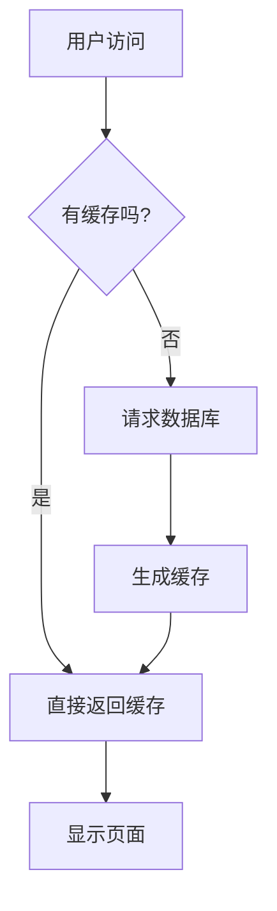

**摘要：** 此前我们把声明和流程混在一起，显得很方便，可是当流程比较复杂的时候，就很有必要将声明和实现分离！

<!--more-->

## 引言

我们**强烈推荐在绘制复杂图表时，先把所有节点一次性声明好，然后再定义它们之间的连接关系。**

这种“声明与实现分离”的写法是管理复杂图表的最佳实践，它能让你的代码变得极其清晰和易于维护。

---

### **为什么以及如何先声明节点**

#### **1. 好处**

*   **清晰易读**：代码分为两部分，“这是我所有的组件”和“这些组件是这样连接的”。逻辑一目了然。
*   **便于维护**：当需要修改某个节点的文字或形状时，你只需在顶部的“声明区”找到它并修改即可，无需在混乱的连接线中寻找。
*   **减少错误**：一次性定义好所有节点和它们的ID，在下面连接它们时就不容易写错ID。
*   **利于规划**：这种写法强迫你先思考图表的全貌，想清楚有哪些参与者和步骤，而不是画到哪算到哪。

#### **2. 具体做法**

我们用一个例子来对比两种写法。

**方法一：边声明边连接（适合简单图表）**

这是我们之前一直在用的方法，对于只有三五个节点的简单图表来说很直观。

```markdowd
graph TD;
    A[用户访问] --> B{有缓存吗?};
    B -- 是 --> C[直接返回缓存];
    B -- 否 --> D[请求数据库];
    D --> E[生成缓存];
    E --> C;
    C --> F[显示页面];
```



当逻辑变多，这种写法会变得混乱。

**方法二：先声明节点，再定义连接（推荐用于复杂图表）**

我们将上面的图表用新的方式重写。

> [!TIP] 最佳实践：声明与连接分离
> 将图表代码分为两个逻辑部分：节点声明区和连接关系区。

**示例代码**
```markdown
```mermaid
graph TD
    %% === 1. 节点声明区 ===
    %% 在这里定义图表中所有会出现的节点
    A[用户访问]
    B{有缓存吗?}
    C[直接返回缓存]
    D[请求数据库]
    E[生成缓存]
    F[显示页面]

    %% === 2. 连接关系区 ===
    %% 在这里定义所有节点之间的连接逻辑
    A --> B
    B -- 是 --> C
    B -- 否 --> D
    D --> E
    E --> C
    C --> F
``````

**渲染效果**
```mermaid
graph TD
    %% === 1. 节点声明区 ===
    %% 在这里定义图表中所有会出现的节点
    A[用户访问]
    B{有缓存吗?}
    C[直接返回缓存]
    D[请求数据库]
    E[生成缓存]
    F[显示页面]

    %% === 2. 连接关系区 ===
    %% 在这里定义所有节点之间的连接逻辑
    A --> B
    B -- 是 --> C
    B -- 否 --> D
    D --> E
    E --> C
    C --> F
```

你会发现，虽然最终渲染的图表是完全一样的，但第二种写法的**源代码可读性**和**可维护性**大大提升了。

---

### **实战演练：一个更复杂的例子**

假设我们要描绘一个稍微复杂点的网站后端请求流程，使用“先声明后连接”以及“子图(subgraph)”来组织它。

> [!NOTE]- 复杂图表示例：后端请求流程
> 这个例子结合了 **节点预声明**、**子图 (subgraph)** 和 **样式 (styling)**，是构建复杂图表的常用技巧。

**示例代码**

```markdown
```mermaid
graph LR
    %% === 样式定义区 ===
    classDef client fill:#d6f2ff,stroke:#0077c2,stroke-width:2px;
    classDef server fill:#fff2d6,stroke:#c27700,stroke-width:2px;
    classDef db fill:#ffd6d6,stroke:#c20000,stroke-width:2px;

    %% === 节点声明区 ===
    UserAgent([<br>用户浏览器])

    subgraph "服务器端"
        direction LR
        Nginx(Nginx 网关)
        AppServer(应用服务器)
        Cache{Redis 缓存}
    end

    subgraph "数据存储"
        direction TB
        DB_Master[(主数据库<br>读/写)]
        DB_Slave[(从数据库<br>只读)]
    end

    %% === 连接关系区 ===
    UserAgent --> Nginx;
    Nginx --> AppServer;
    AppServer -- 查询数据 --> Cache;
    Cache -- 缓存未命中 --> AppServer;
    Cache -- 缓存命中 --> Nginx;
    AppServer -- 读数据 --> DB_Slave;
    AppServer -- 写数据 --> DB_Master;
    DB_Master -- 数据同步 --> DB_Slave;

    %% === 应用样式 ===
    class UserAgent client;
    class Nginx,AppServer,Cache server;
    class DB_Master,DB_Slave db;
``````

**渲染效果**

```mermaid
graph LR
    %% === 样式定义区 ===
    classDef client fill:#d6f2ff,stroke:#0077c2,stroke-width:2px;
    classDef server fill:#fff2d6,stroke:#c27700,stroke-width:2px;
    classDef db fill:#ffd6d6,stroke:#c20000,stroke-width:2px;

    %% === 节点声明区 ===
    UserAgent([<br>用户浏览器])

    subgraph "服务器端"
        direction LR
        Nginx(Nginx 网关)
        AppServer(应用服务器)
        Cache{Redis 缓存}
    end

    subgraph "数据存储"
        direction TB
        DB_Master[(主数据库<br>读/写)]
        DB_Slave[(从数据库<br>只读)]
    end

    %% === 连接关系区 ===
    UserAgent --> Nginx;
    Nginx --> AppServer;
    AppServer -- 查询数据 --> Cache;
    Cache -- 缓存未命中 --> AppServer;
    Cache -- 缓存命中 --> Nginx;
    AppServer -- 读数据 --> DB_Slave;
    AppServer -- 写数据 --> DB_Master;
    DB_Master -- 数据同步 --> DB_Slave;

    %% === 应用样式 ===
    class UserAgent client;
    class Nginx,AppServer,Cache server;
    class DB_Master,DB_Slave db;
```