**摘要：** 你还在用**Mirosoft Visio** 绘制**流程图** 吗？那么你已经落伍了，现在是**Mermaid** 时代！

<!--more-->

## 引言

这是一份为你精心准备的、从零开始的 Mermaid 快速全面入门教程。通过这份教程，你将能快速掌握使用代码绘制各种精美图表的核心技能。

---

### **Mermaid 入门**

#### **第一章：Mermaid 是什么？为什么选择它？**

**1.1 什么是 Mermaid？**

Mermaid 是一种基于 JavaScript 的图表和图表绘制工具。它使用一种类似于 Markdown 的简单文本语法，让你能够通过编写代码来生成流程图、时序图、甘特图等多种图表。

**一句话概括：代码生成图表 (Diagram as Code)。**

**1.2 为什么你应该学习 Mermaid？**

*   **简单高效**：语法非常直观，学习曲线平缓，几分钟就能上手。
*   **便于版本控制**：图表就是文本，可以轻松地使用 Git 等工具进行版本管理和协作。
*   **易于维护**：修改图表只需修改几行代码，而不用拖拽像素点，非常方便。
*   **跨平台集成**：被广泛集成在各种 Markdown 编辑器、文档工具（如 Notion, Typora, VS Code 插件）、和开发平台（如 GitLab, GitHub）中。
*   **专注内容**：让你专注于图表的逻辑和内容，而不是纠结于样式和布局。

---

#### **第二章：牛刀小试 - 你的第一个 Mermaid 图**

**2.1 环境准备**

你不需要安装任何东西就能立即开始！

*   **推荐方式：在线编辑器**
    访问 **[Mermaid Live Editor](https://mermaid.live/)**，这是官方的在线实时编辑器。左边写代码，右边立即就能看到生成的图表。

*   **本地方式：Markdown 编辑器**
    大多数现代 Markdown 编辑器（如 Typora, VS Code + `Markdown Preview Mermaid Support` 插件）都支持 Mermaid。你只需要在一个代码块中指定语言为 `mermaid` 即可。

    ````markdown
    ```mermaid
    // 在这里写你的 Mermaid 代码
    ```
    ````

**2.2 第一个流程图 (Flowchart)**

让我们来创建一个经典的 "Hello World" 流程图。在编辑器中输入以下代码：

```markdown
graph TD;
    A[开始] --> B(处理);
    B --> C{判断};
    C -- Yes --> D[结束];
    C -- No --> B;
```


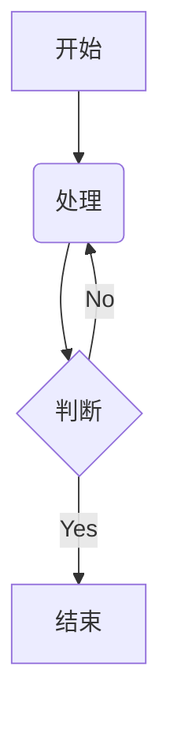

**代码解析：**

*   `graph TD;`: 定义一个图表（`graph`），方向为从上到下（`TD` - Top Down）。其他方向还有 `LR` (Left to Right), `RL` (Right to Left) 等。
*   `A[开始]`: 定义一个节点，ID 为 `A`，显示的文本是 "开始"。`[]` 表示矩形。
*   `B(处理)`: 定义一个 ID 为 `B` 的节点，`()` 表示圆角矩形。
*   `C{判断}`: 定义一个 ID 为 `C` 的节点，`{}` 表示菱形（常用于判断）。
*   `-->`: 表示一个带箭头的连接线。
*   `C -- Yes --> D`: 在连接线上添加文本 "Yes"。

你会在右侧看到一个清晰的流程图被自动生成了！

---

#### **第三章：核心图表类型实战**

现在，我们来快速学习几种最常用的图表。

**3.1 流程图 (Flowchart) - 深入**

流程图是 Mermaid 最强大的功能之一。

*   **不同节点形状**

```markdown
graph LR;
    A[矩形]
    B(圆角矩形)
    C((圆形))
    D{菱形}
    E>右向旗帜]
    F{{六边形}}
```

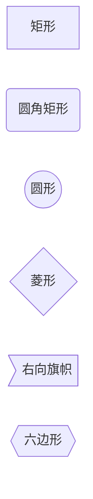

*   **不同连接线样式**

```markdown
graph TD;
        A -- 普通线 --- B;
        C --带箭头--> D;
        E -. 虚线 .-> F;
        G == 粗线 ==> H;
        I -- 带文字 --> J;
```

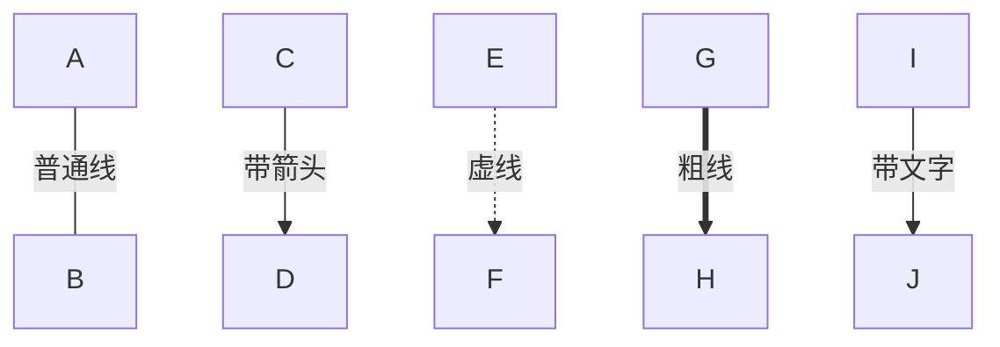

**3.2 时序图 (Sequence Diagram)**

时序图用于展示对象之间随时间变化的交互。

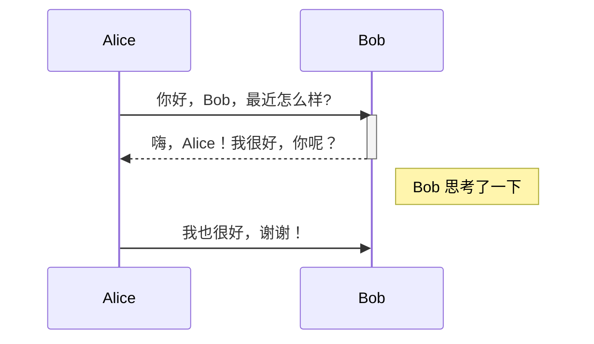

```markdown
sequenceDiagram
    participant Alice
    participant Bob
    Alice ->> Bob: 你好，Bob，最近怎么样?
    activate Bob
    Bob -->> Alice: 嗨，Alice！我很好，你呢？
    deactivate Bob
    Note right of Bob: Bob 思考了一下
    Alice ->> Bob: 我也很好，谢谢！
```

**代码解析：**

*   `sequenceDiagram`: 声明这是一个时序图。
*   `participant Name`: 定义一个参与者。
*   `->>`: 表示一条实线的同步消息。
*   `-->>`: 表示一条虚线的异步/返回消息。
*   `activate/deactivate`: 表示参与者的生命线（激活/非激活状态）。
*   `Note right of Who: Text`: 在某个参与者的右边添加一个备注。

**3.3 甘特图 (Gantt Chart)**

甘特图是项目管理的利器，用于展示任务的时间安排。

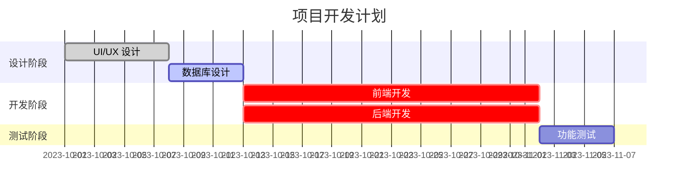

```markdown
gantt
    title 项目开发计划
    dateFormat YYYY-MM-DD
    section 设计阶段
    UI/UX 设计     :done, des1, 2023-10-01, 7d
    数据库设计     :active, des2, after des1, 5d
    section 开发阶段
    前端开发       :crit, dev1, after des2, 20d
    后端开发       :crit, dev2, after des2, 20d
    section 测试阶段
    功能测试       :       test1, after dev1, 5d
```

**代码解析：**

*   `gantt`: 声明是甘特图。
*   `title`: 图表标题。
*   `dateFormat`: 指定日期格式。
*   `section Name`: 定义一个任务分组。
*   `任务名称 :状态, ID, 开始时间, 持续时间`
    *   **状态**: `done` (已完成), `active` (进行中), `crit` (关键任务), 留空则为普通。
    *   **ID**: 任务的唯一标识符。
    *   **开始时间**: 可以是具体日期，也可以用 `after ID` 表示在某个任务之后开始。
    *   **持续时间**: `d` (天), `w` (周)。

**3.4 饼图 (Pie Chart)**

用于展示各部分的占比，非常直观。

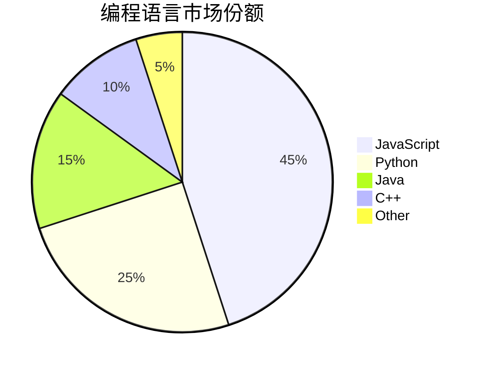

```markdown
pie
    title 编程语言市场份额
    "JavaScript" : 45
    "Python" : 25
    "Java" : 15
    "C++" : 10
    "Other" : 5
```

**代码解析：**

*   `pie`: 声明是饼图。
*   `title`: 标题。
*   `"标签" : 数值`: 定义每个扇区的标签和对应的数值。

**3.5 类图 (Class Diagram)**

对于软件开发者，类图是描述系统结构的重要工具。

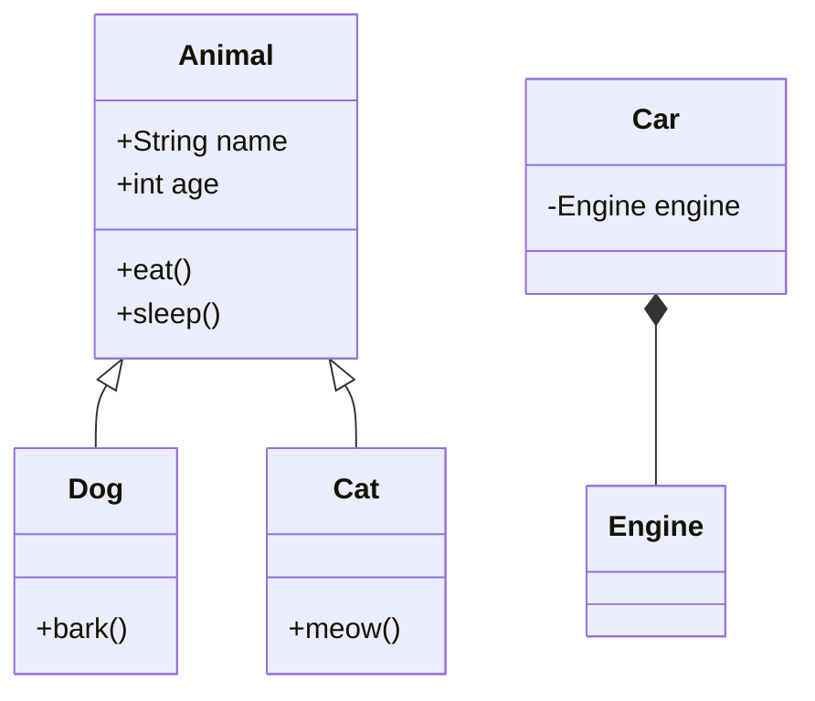

```markdown
classDiagram
    class Animal {
      +String name
      +int age
      +eat()
      +sleep()
    }
    class Dog {
      +bark()
    }
    class Cat {
      +meow()
    }
    Animal <|-- Dog
    Animal <|-- Cat
    
    class Car {
        -Engine engine
    }
    Car *-- Engine
```

**代码解析：**

*   `classDiagram`: 声明是类图。
*   `class Name { ... }`: 定义一个类。
*   `+` 表示 `public`, `-` 表示 `private`, `#` 表示 `protected`。
*   `+String name`: 定义公共属性。
*   `+eat()`: 定义公共方法。
*   `<|--`: 表示继承 (Inheritance)。
*   `*--`: 表示组合 (Composition)。
*   `o--`: 表示聚合 (Aggregation)。
*   `-->`: 表示关联 (Association)。

---

#### **第四章：进阶技巧，让你的图表更出色**

**4.1 添加样式 (Styling)**

你可以使用 `classDef` 和 `class` 来为节点定义和应用 CSS 样式。

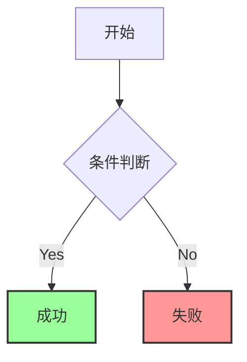

**4.2 子图 (Subgraphs)**

使用 `subgraph` 将一组节点组织在一起，使复杂图表更有条理。

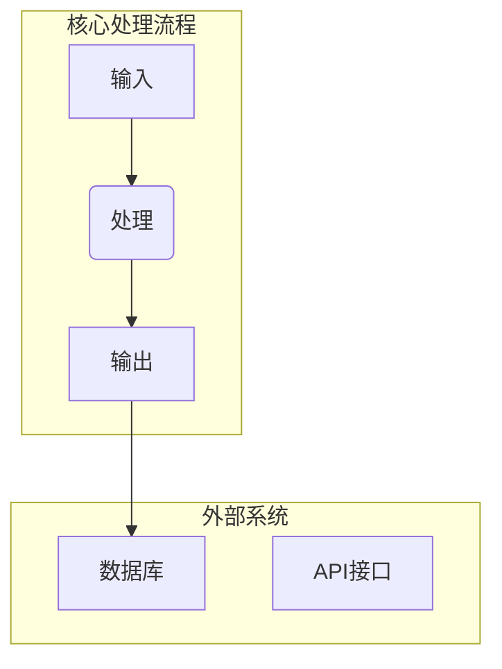

**4.3 添加注释**

使用 `%%` 来添加注释，注释不会被渲染。
但是在这里不行，不知道是什么原因
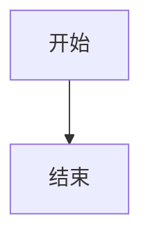

**4.4 交互性**

在支持的环境下（如浏览器），可以为节点添加点击事件。

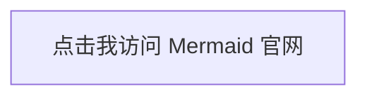

---

#### **第五章：资源与下一步**

恭喜你！你已经掌握了 Mermaid 的核心用法。

*   **官方文档 (终极参考)**: [Mermaid Documentation](https://mermaid.js.org/intro/)
    *   这里有所有图表类型、配置和语法的最全介绍。
*   **官方在线编辑器 (最佳练习场)**: [Mermaid Live Editor](https://mermaid.live/)
    *   不断尝试，不断练习，这是最好的学习方式。
*   **Mermaid Cheatsheet (速查表)**: 在网上搜索 "Mermaid Cheatsheet" 可以找到很多有用的语法速查表。

**总结：**

Mermaid 的哲学是 "简单就是美"。它将图表的复杂性隐藏在简单的文本之后，让你能够以前所未有的速度和便捷性创建、分享和维护图表。现在，就在你的下一个项目文档、博客文章或笔记中开始使用它吧！